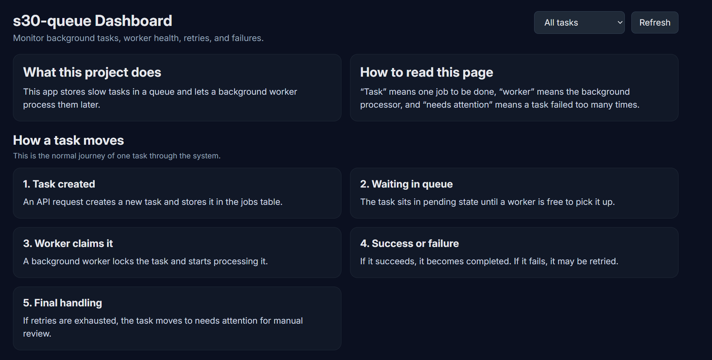
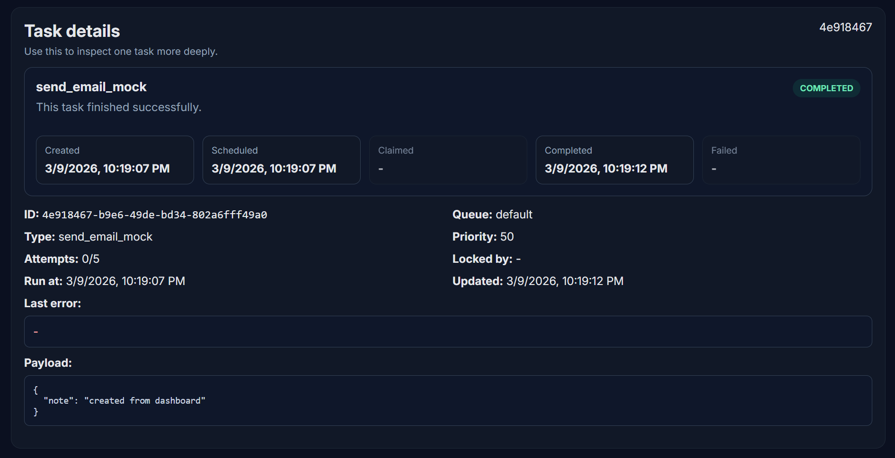
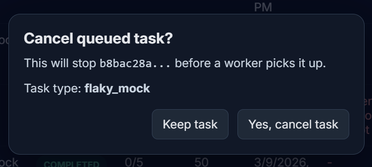

# s30-queue - Background Job Queue System

<p align="center">
  
</p>

A production-style full-stack background job queue system built as Project 2 of my 3-project backend/full-stack journey. It focuses on asynchronous task processing, worker-driven execution, retries, dead-letter handling, queue monitoring, and clean operator experience.

---

## 🚀 Live Demo

Frontend: https://s30-queue-web.vercel.app
Backend Health: https://s30-queue-api.onrender.com/health
---

## 🎯 Features

### Core Queue Functionality

- Create background jobs from the dashboard or API
- Store queued jobs in PostgreSQL
- Process jobs asynchronously through worker polling
- Inspect task details and queue states
- Support pending, processing, completed, failed, dead-letter, and cancelled flows

### Reliability Features

- Retry failed jobs from the dashboard
- Max-attempt handling for controlled retries
- Dead-letter style manual review state after repeated failures
- Pending job cancellation before processing starts
- Confirmation dialog before destructive cancel action
- Job priority and scheduled run time support

### Monitoring and Dashboard

- Queue summary statistics
- Recent tasks table with pagination
- Task status filtering and search
- Worker health monitoring
- Task timeline and payload inspection
- Auto-refreshing operator dashboard

---

## 🛠️ Tech Stack


---

## 📌 Why This Project

This project was built to go beyond basic CRUD apps and implement the parts that matter in real-world async processing systems:

- background task execution
- retries and failure handling
- dead-letter workflows
- worker health visibility
- queue monitoring dashboards
- operator control actions

It is also the second project in my 3-project build journey:
1. Authentication System
2. Background Job Queue
3. Real-Time Collaborative Editor

---

## 🔐 Queue Design

### Task Model

- Each task is stored in a `jobs` table
- Jobs carry queue name, type, payload, status, priority, timestamps, and retry metadata
- Workers claim eligible pending jobs and update state as processing progresses
- This design keeps queue state visible and queryable inside the database

### Reliability Strategy

- Failed jobs can be retried up to a configured max-attempt limit
- Repeated failures can move tasks into a dead-letter / needs-attention state
- Pending jobs can be cancelled before a worker starts processing them
- This design supports operational control and safer recovery flows

### Operator Controls

- Retry is available for failed and dead-letter tasks
- Cancel is available for pending tasks only
- Confirmation is shown before destructive cancellation
- Dashboard actions immediately refresh queue state

### Monitoring Rules

- Queue depth, retrying count, dead-letter count, and oldest pending age are tracked
- Worker heartbeat data is surfaced in the UI
- Stale or unhealthy workers can be highlighted for manual inspection

This helps keep async workflows understandable while still being practical.

---

## 👤 User Flow

### Create Task

- Operator creates a task from the dashboard
- Task input is validated
- Task record is inserted into the queue
- Task enters pending state

### Worker Processing

- Worker polls for eligible work
- Worker claims a pending task
- Task moves into processing state
- Worker updates the final outcome

### Retry / Failure Handling

- If a task fails, attempts are updated
- If attempts remain, task can be retried
- If retries are exhausted, task moves to dead-letter / needs-attention

### Cancel

- Pending tasks can be cancelled from the dashboard
- Confirmation is required before cancellation
- Cancelled tasks are stopped before worker processing begins

---

## 🗂️ Project Structure

```bash
s30-queue/
├── api/                  # Backend service
│   ├── src/
│   │   ├── routes/
│   │   ├── db/
│   │   ├── workers/
│   │   └── utils/
│   └── package.json
├── web/                  # Frontend app
│   ├── public/
│   ├── src/
│   │   ├── components/
│   │   ├── App.tsx
│   │   ├── api.ts
│   │   └── styles.css
│   ├── index.html
│   └── package.json
└── README.md
```

> Folder names may vary slightly as the project evolves, but the repo follows a frontend + backend split with a worker-driven execution model.

---

## ⚙️ Environment Variables

### Backend

```env
DATABASE_URL=your_postgres_connection_string
PORT=3000
NODE_ENV=development
```

### Frontend

```env
VITE_API_BASE_URL=http://localhost:3000
```

---

## 📋 Local Setup

### Prerequisites

- Node.js
- npm
- PostgreSQL connection string

### Installation

1. Clone the repository

```bash
git clone https://github.com/<your-username>/s30-queue.git
cd s30-queue
```

2. Install backend dependencies

```bash
cd api
npm install
```

3. Add backend environment variables

```bash
cp .env.example .env
```

4. Install frontend dependencies

```bash
cd ../web
npm install
```

5. Add frontend environment variables

```bash
cp .env.example .env
```

---

## ▶️ Run Locally

### Start backend

```bash
cd api
npm run dev
```

### Start frontend

```bash
cd web
npm run dev
```

### Start worker

```bash
cd api
npm run worker
```

### Open app

```txt
http://localhost:5173
```

---

## 🌍 Production Deployment

### Frontend

- Can be deployed separately as a React/Vite app
- Dashboard should point to the backend API base URL through environment variables
- Production UI should be able to consume queue stats, job routes, and worker health endpoints

### Backend

- Can be deployed as an Express service
- Uses environment-based database configuration
- Health route and queue APIs should be exposed for monitoring and frontend integration

### Worker

- Worker should run as a separate long-running process
- Worker process must connect to the same database as the API
- Production setup should ensure worker availability and heartbeat updates

### Cross-Service Setup

For production, the frontend, backend, and worker must share compatible environment configuration so task creation, processing, and monitoring work together reliably.

---

## 🔌 API Overview

Example queue routes:

```txt
POST   /jobs
GET    /jobs
GET    /jobs/:id
POST   /jobs/:id/retry
POST   /jobs/:id/cancel
GET    /queues/stats
GET    /workers/health
```

> Actual route names may differ slightly depending on the current backend implementation.

---

## 🖼️ Screenshots







---

## 📚 What I Learned

This project helped me practice:

- async job system design
- worker-based task processing
- retry and dead-letter flows
- queue state modeling in PostgreSQL
- dashboard-based monitoring and control
- backend thinking around reliability and operations

It also helped me understand why background processing systems need more than just inserting and reading rows.

---

## 📈 Future Improvements

- Exponential backoff strategy
- Scheduled jobs UI
- Multiple workers with configurable concurrency
- Named queue management
- Authentication and admin-only operator controls
- Metrics charts and richer observability
- Automated tests and CI pipeline
- Deployment guide

---

## 🗺️ Roadmap Position

This is **Project 2/3** in my full-stack systems journey:

- Project 1: Secure Authentication System
- Project 2: Background Job Queue
- Project 3: Real-Time Collaborative Editor

The goal is to build progressively stronger backend and full-stack systems with real deployment experience.

---

## 🤝 Contributing

1. Fork the repository
2. Create a feature branch
3. Commit your changes
4. Push the branch
5. Open a pull request

---

## 📬 Contact

If you want to discuss the project, suggest improvements, or connect about backend/full-stack development, feel free to open an issue or reach out through GitHub.

---

Built with a systems-first mindset and shipped as part of a practical full-stack project journey.
